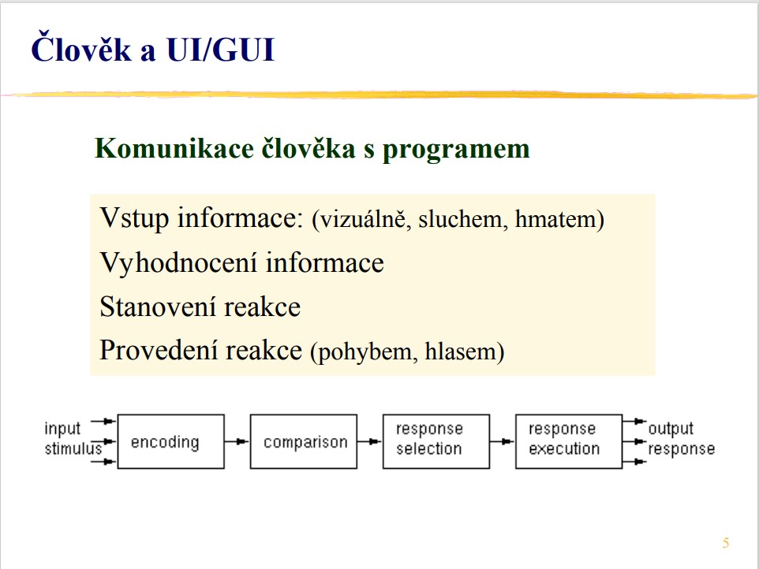
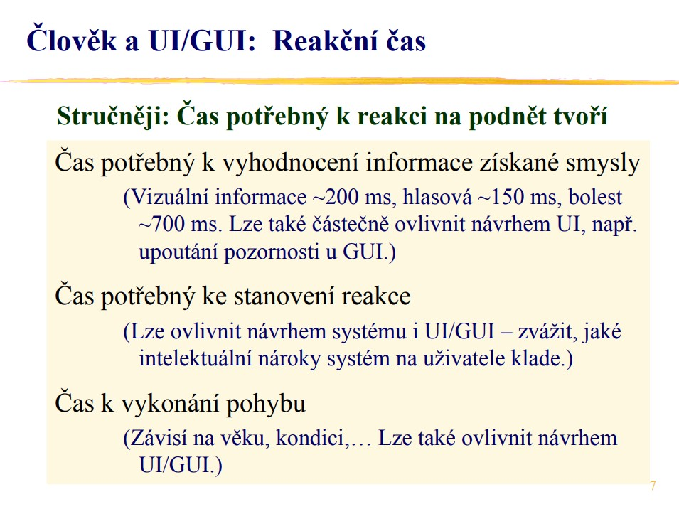
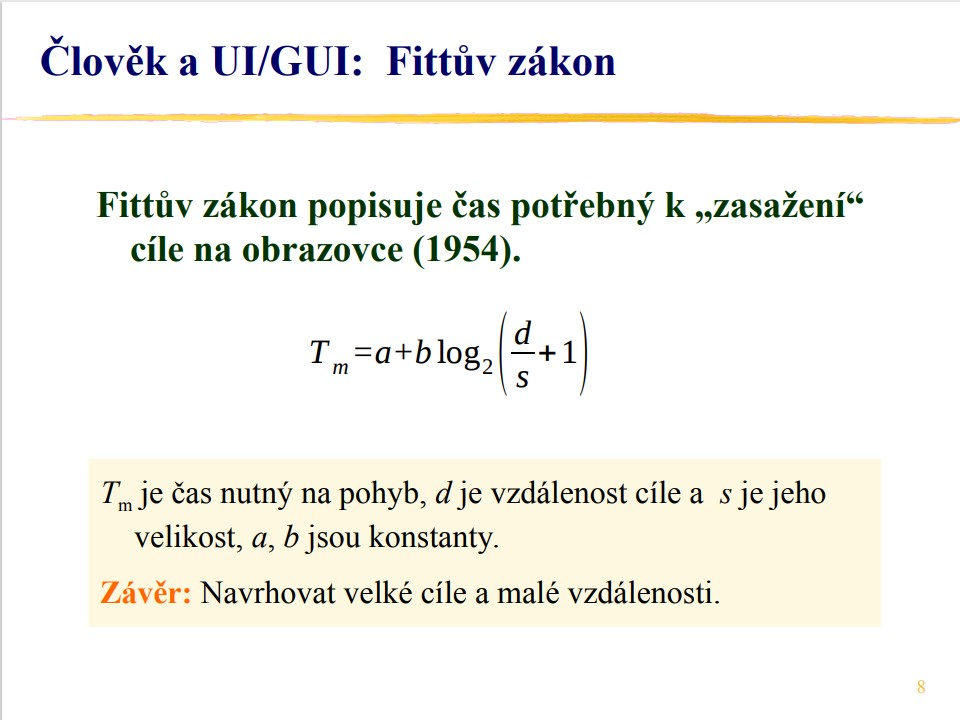
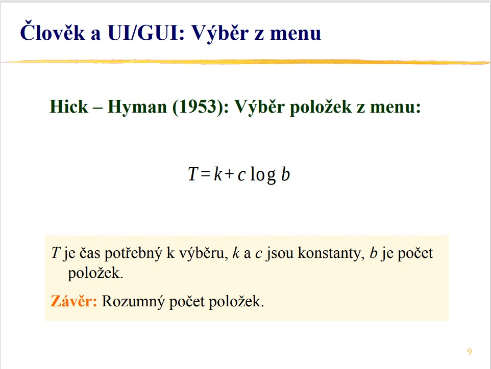
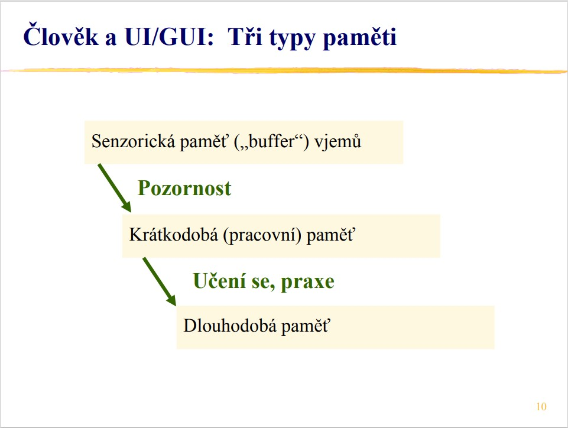
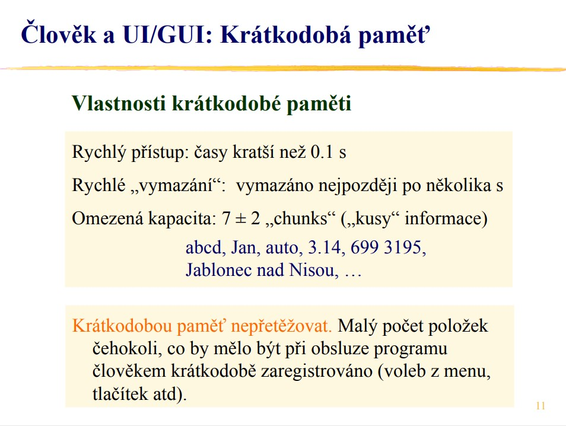
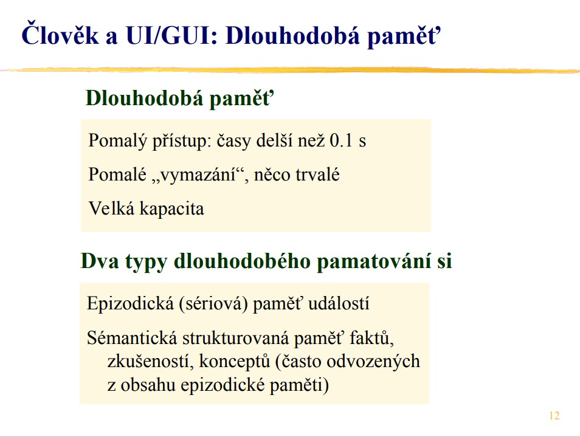
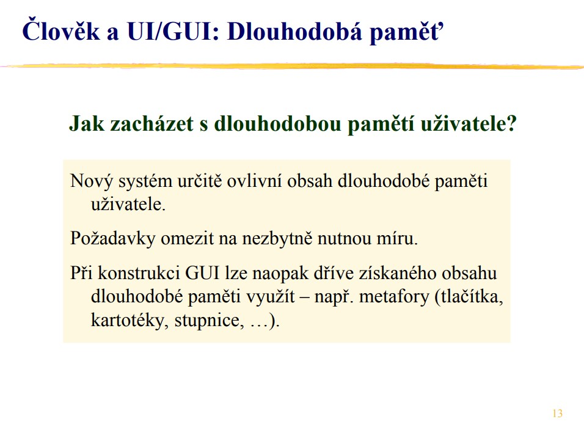

# 🎨 Počítačová grafika (ZPG, URO)

Tento dokument obsahuje vypracovanie okruhov k predmetu **Počítačová grafika** podľa oficiálnych štátnicových požiadaviek. Využíva GitHub Markdown.

---

## 🧠 1. Metody a nástroje pro realizaci grafických uživatelských rozhraní

### Témata:
- Kognitivní schopnosti člověka  
- Mentální modely  
- Základní pravidla designu  
- Barevné prostory  
- Volba barev a prezentace textu

### 📝 Vypracovanie:

#### 🔹 Kognitivní schopnosti člověka
> Jak lidské vnímání, paměť, pozornost a zrakové rozpoznávání ovlivňují návrh rozhraní.

- Dobre navrhnuté použivateľské rozhranie skracuje čas reakcie a provedení reakce

- dôležitá časť fitovho zákona (d/s) kde d je dĺžka a s je veľkosť cieľa. skrátenie času zasiahnutia cieľa priamo súvisí z rýchlosťou provedení reakce. to znamená **čím väčšie a bližšie pri sebe sú elementy ktoré slúžia na ovládanie rozhrania tým lepšie je uživateľské rozhranie**

- výber z menu priamo súvisí z množstvom položiek v menu. čím ma menu menej položiek tým lepšie menu (antipríklad VS menu)

- Uživateľské rozhranie by malo využívať čo najviac dlhodobú pamäť nadobudnutú z ostatných aplikácií napríklad pohyb v menu pomocou šípiek, odoslanie formulára pomocou enteru, pohyb v 3D pomocou WASD a podobne.. 

> Gestaltová teorie popisuje, ako človek prirodzene vníma usporiadanie vizuálnych prvkov ako celky namiesto jednotlivostí.  
> V dizajne používateľského rozhrania sa uplatňuje napríklad v princípoch:
> - **Objekt a pozadie** – schopnosť oddeliť prvok od pozadia,
> - **Idealizovaný tvar** – dopĺňanie neúplných obrazcov do známych tvarov,
> - **Blízkosť a vytváranie skupín** – zhlukovanie súvisiacich prvkov,
> - **Kontinuita** – vnímanie plynulých línií a usporiadania,
> - **Symetria** – rozpoznanie vyvážených, harmonických tvarov,
> - **Vnímanie na základe skúsenosti** – rýchla orientácia v známom prostredí.

---

#### 🔹 Mentální modely
> Jak lidé rozumí systému, na základě jejich předchozích zkušeností.

---

#### 🔹 Základní pravidla designu
> Principy použitelnosti a estetiky (např. konzistence, zpětná vazba, affordance).

---

#### 🔹 Barevné prostory
> RGB, CMYK, HSV – popis, rozdíly, využití.

---

#### 🔹 Volba barev a prezentace textu
> Kontrast, čitelnost, barvoslepost, výběr barev pro různé režimy (dark/light mode).

---

## 🖼️ 2. Standardní zobrazovací řetězec

### Témata:
- Realizace jednotlivých kroků řetězce  
- Modelovací a zobrazovací transformace  
- Phongův osvětlovací model  
- Řešení viditelnosti  
- Identifikace těles  
- Stručná charakteristika OpenGL a jazyka GLSL

### 📝 Vypracovanie:

---

## 📐 3. Geometrické modelování

### Témata:
- Afinní a projektivní prostory  
- Popis těles a možnosti jejich reprezentace  
- Základní křivky (Fergusonova kubika, Bézierova křivka)  
- Vlastnosti a použití týchto kriviek

### 📝 Vypracovanie:

---

## ❓ Příkladová otázka

> **Popište možnosti reprezentace těles a způsob jejich vykreslení pomocí standardního zobrazovacího řetězce v kontextu grafického rozhraní OpenGL.**

---

