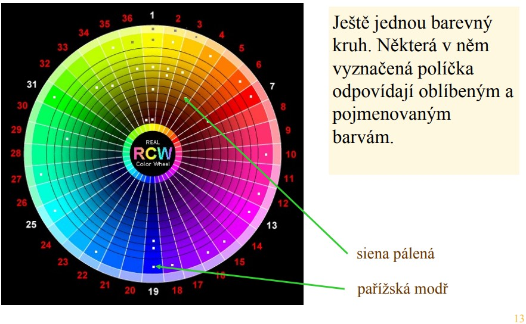

# 🎨 Počítačová grafika (ZPG, URO)

Tento dokument obsahuje vypracovanie okruhov k predmetu **Počítačová grafika** podľa oficiálnych štátnicových požiadaviek. Využíva GitHub Markdown.

---

## 🧠 1. Metody a nástroje pro realizaci grafických uživatelských rozhraní

## Témata:
- Kognitivní schopnosti člověka  
- Mentální modely  
- Základní pravidla designu  
- Barevné prostory  
- Volba barev a prezentace textu

### 📝 Vypracovanie:

# 🔹 1.1 Kognitivní schopnosti člověka
> Jak lidské vnímání, paměť, pozornost a zrakové rozpoznávání ovlivňují návrh rozhraní.

**Komunikace človeka s programem**
---
1. vstupni informace
2. vyhodnoceni informace
3. stanovení reakce
4. provedení reakce

**reakčný čas**
---

- čas potrebný k vyhodnocení reakce 
- čas potrebný k stanovení reakce
- čas k vykonáni pohybu

Dobre navrhnuté použivateľské rozhranie skracuje čas reakcie a provedení reakce


**fittuv zákon popisuje čas zasažení cíle na obrazovce**
---


T - čas k zasažení \
a, b - konštanty \
d - vzdialenosť od cieľa \
s - veľkosť cieľa 

- dôležitá časť fitovho zákona (d/s) kde d je dĺžka a s je veľkosť cieľa. skrátenie času zasiahnutia cieľa priamo súvisí z rýchlosťou provedení reakce. to znamená **čím väčšie a bližšie pri sebe sú elementy ktoré slúžia na ovládanie rozhrania tým lepšie je uživateľské rozhranie**

**čas výberu položiek z menu**
---


T- čas k výberu \
k, c - konštaty \
b - počet položiek 

- výber z menu priamo súvisí z množstvom položiek v menu. čím ma menu menej položiek tým lepšie menu (antipríklad VS menu)


**typy pameti**
---


**krátkodobá pamäť**
---  

rýchle strata zvyčajne si človek pamätá 7 +- 2 položky
> nie je vhodne krátkodobú pamäť preťažovať


**dlhodobá pamäť**
---  
> Uživateľské rozhranie by malo využívať čo najviac dlhodobú pamäť nadobudnutú z ostatných aplikácií napríklad pohyb v menu pomocou šípiek, odoslanie formulára pomocou enteru, pohyb v 3D pomocou WASD a podobne, a čo najmenej meniť ovládanie alebo celkové rozloženie systému.


**Gesalt theory**
---  


> Gestaltová teorie popisuje, ako človek prirodzene vníma usporiadanie vizuálnych prvkov ako celky namiesto jednotlivostí.  
> V dizajne používateľského rozhrania sa uplatňuje napríklad v princípoch:

- **Objekt a pozadie** – schopnosť oddeliť prvok od pozadia,
- **Idealizovaný tvar** – dopĺňanie neúplných obrazcov do známych tvarov,
- **Blízkosť a vytváranie skupín** – zhlukovanie súvisiacich prvkov,
- **Kontinuita** – vnímanie plynulých línií a usporiadania,
- **Symetria** – rozpoznanie vyvážených, harmonických tvarov,
- **Vnímanie na základe skúsenosti** – rýchla orientácia v známom prostredí.


**8 zlatých pravidiel dobrého UI**
---


---

# 🔹 1.2 Mentální modely
>človek hľadá vo všetkom systém a postúpnosť aby si uľahčil premýšlanie.


**mentálne modely formujú realitu do skupín pre jednoduchšie porozumenie systému**

> Když se model podaří nalézt, pak nastupuje:
- pocit jistoty a ovládnutí produktu,
- pocit víry, že lze odhadnout chování v nových situacích, 
- pocit víry, že produkt v nových situacích uspěje. 
> Když ne, pak pocity opačné
- nejistoty, frustrace, skepse
- nejistota, zda pro nové úkoly bude produkt vhodný.

pre dobré uživateľské rozhranie je výhodné mať jednoducho a rýchlo vytvoritelný mentálny model aplikácie. Dá sa využiť už existujúce skúsenosti uživateĺa s mentálnymi modelmi (rozvrhovať rozhranie podľa už existujúceho rozhrania)

tvorba dobrého mentálneho modelu
- Udělejte inventuru veškeré komunikace vašeho programu 
s uživatelem. Rozdělte komunikaci na části, které budou tvořit 
jednotlivá menu, dialogová okna, případně stránky. Obsah oken 
rozdělte na části (max. přibližně 7) obsahující prvky GUI. Menu 
a podmenu organizujte tak aby délka zpravidla nebyla větší než 
max. cca 12 položek.
-  Pro každé okno, skupinu prvků GUI, menu, podmenu nalezněte 
maximálně výstižné názvy (To je naprosto zásadní, a to i tehdy, 
když v GUI některé z nich nakonec nebudou vidět).
- Nakreslete si schéma řazení menu, oken, stránek na papír 
(mentální model GUI). Podobně nakreslete i zamýšlené mentální 
modely jednotlivých oken. 

---

# 🔹 1.3 Základní pravidla designu
---
**1. Konzistence:**
---
- Podobné posloupnosti akcí v podobných situacích
- Konzistentní terminologie (např. na různých místech menu, menu a nápověda, …)
- Podobný vzhled oken, stránek, konzistentní 
používání barev, fontů, grafiky (ikon), … 

**2. Informativni zpětná vazba**
---
- Na každou akci uživatele reagovat zpětnou vazbou 
signalizující, že se něco děje nebo stalo.
- Být tak konkrétní, jak je na základě od uživatele 
získaných informací možné. 

**3. Prevence chyb a řešení chybových situací**
---
- Nedovolte uživateli udělat chybu. Např.: Zakažte 
položky v menu (tlačítka, …), které by v daném 
okamžiku neměly být provedeny. Nedovolte psát 
písmena, když mají vstoupit čísla. Ihned provést 
možné kontroly správnosti (rozsahy atd.).
- Když už chyba vznikne, poskytněte uživateli 
nápovědu, jak ji odstranit.

**4. UNDO možnosť**
---
-  Bez komentáře – prostě vždy a pokud možno na 
všechno. Realizujte také „redo“.

**5. Zkušený uživatel požaduje plnou kontrolu nad produktem**
---
- Jednoduše: Zkušený uživatel chce mít produkt 
zcela „přečtený“. Jestliže se mu nepodaří 
dosáhnout tohoto stavu, produkt se mu nelíbí.

**6. Připravte produkt také pro zkušené uživatele**
---
- Důmyslná GUI vyhovují zpravidla spíše uživateli 
nezkušenému.
- Zkušeného uživatele komplikované GUI při 
provádění běžných akcí obvykle zdržuje (např. 
opakované otvírání víceúrovňových menu pro vy 
volání příkazu).
- Zkušený uživatel přivítá: možnost zápisu příkazu 
(krátká jména příkazů) na příkazový řádek, 
klávesové zkratky, makra, …

**7. Organizujte akce do uzavřených celků**
---
- Komplikované akce s větším počtem kroků 
rozdělte na menší celky mající jasný začátek a 
konec. Po vykonání každého celku zpětná vazba, 
jak to dopadlo. Také velké formuláře rozdělte na 
menší (uživatele o tom ale předem informujte).

**8. Nepřetěžujte krátkodobou paměť a vizuální systém uživatele**
---
- Přiměřený počet položek v menu, tlačítek ve 
skupinách, přehledná a jasná struktura obrazovky 
(okna, stránky).
- Nedopusťte chaos na obrazovce. I 
komplikovanější struktura se ale může stát 
přijatelnou, jestliže je okno, stránka, obrazovka 
vnímáno jako pěkné.


---

# 🔹 1.4 Barevné prostory  
> Využitie farebných priestorov, ich význam v navrhovaní GUI a zásady práce s farbami.

**Základy farebného vnímania**
---
- Farba vzniká ako výsledok interakcie svetla rôznych vlnových dĺžok s čapíkmi v sietnici oka.
- Ľudské oko má 3 typy čapíkov: pre červenú, zelenú a modrú. Najcitlivejšie je na **žltú farbu** (kombinácia červenej a zelenej).
- Približne **8 % populácie má poruchu farebného videnia**, čo je nutné pri návrhu GUI zohľadniť.


**Modely farebných priestorov**
---
- **RGB** (Red, Green, Blue) – používa sa pre displeje. Každý pixel má hodnoty R, G a B.
- **HSV** (Hue – odtieň, Saturation – sýtosť, Value – jas) – intuitívnejší pre výber farby.
- **CMY(K)** – subtraktívny model používaný pri tlači (cyan, magenta, yellow, black).

---
 

HSV kuzel

---


HSV

---


RGB/CMY(K)

---

**Reprezentácia farieb**
---
- V GUI systémoch sa často používa zápis pomocou RGB zložiek.
- **"Web-safe" farby** – historicky obmedzená paleta 216 farieb kompatibilných s 256-farebnými monitormi (dnes málo významné).

**Farebný kontrast**
---
- Kľúčový pre čitateľnosť – W3C odporúča:
  - Jasový rozdiel (brightness): väčší než 125.
  - Rozdiel zložiek (color difference): väčší než 500.

```plaintext
Brightness = (299×R + 587×G + 114×B)/1000
Color Difference = ∑ max - min pre každú zložku R, G, B
```

**Pravidlá pri výbere farieb v GUI**
---
- **Používaj málo farieb** – menej je často viac.
- **Vyhýbaj sa agresívnym kombináciám** – napr. červená a modrá vedľa seba sú únavné pre zrak.
- **Zvýš kontrast pre zrakovo postihnutých** – pomáha využiť zvyšky farebného vnímania.


**Typy farebných schém**
---
- **Monochromatická** – rôzne jasy a sýtosti jednej farby. Harmonické a nenásilné.
- **Analógová** – farby blízko seba na farebnom kruhu. Fungujú v prírode aj dizajne.
- **Komplementárna** – farby oproti sebe na farebnom kruhu. Veľmi kontrastné, opatrne s použitím pri texte.



**Teplé a studené farby**
---
- **Teplé** (červená, oranžová, žltá) – pôsobia aktívne, energicky.
- **Studené** (modrá, zelená) – pôsobia upokojujúco a pasívne.


**Farebné schémy v praxi**
---
- Príroda aj umenie ponúkajú inšpirácie – napr. Monet, Van Gogh, Vermeer.
- **Príklady z výtvarného umenia** ukazujú, ako kombinovať kontrast, sýtosť a teplotu farieb.


blizke farby sa nachádzajú v malom kruhu na z velkeho HSW

---


komplementárne sa nachádzajú dva kruhove vyrezy oproti sebe na HSW (2 monochromaticke farby tvoriace komplementarne farby)


volba farieb podla moneta 3 kruhove vyrezy tvoriace "radioaktivny piktogram" (3 monochromaticke tvoriace komplementarne farby)


**Zásady pre návrh UI z hľadiska farieb**
---
- Zachovaj konzistenciu v použitých farbách naprieč aplikáciou.
- Biela alebo veľmi svetlá farba je najvhodnejšia pre pozadie s textom.
- Sýte farby používaj na zvýraznenie, ale šetrne.
- Uvažuj aj kultúrne a emocionálne asociácie farieb.


---

# 🔹 1.5 Volba barev a prezentace textu
> Kontrast, čitelnost, barvoslepost, výběr barev pro různé režimy (dark/light mode).

---

**Prezentácia textu – dôležité zásady**
---

- Texty musia byť vizuálne usporiadané tak, aby uľahčovali čítanie a zapamätanie obsahu.
- Dôležité informácie zvýrazni nadpisom, vizuálnou hierarchiou alebo obrázkom.
- Vzhľad stránky priamo ovplyvňuje, či bude čitateľ ochotný pokračovať v čítaní.


zlé/dobré

---

**Organizácia textu a čitateľnosť**
---

- Vizuálna štruktúra pomáha čitateľovi vytvoriť si **mentálny model** stránky.
- Odporúča sa rozbíjať text do kratších odstavcov, používať odrážky, deliace prvky a nadpisy.
- Dlhé riadky znižujú čitateľnosť – ideálne je **60–70 znakov na riadok**.


zlé/dobré

---

**Sadzba textu a zarovnanie**
---

- **Obojstranné zarovnanie** (justifikácia) vytvára tzv. „rieky“ – vizuálne prázdne pásy, ktoré zhoršujú čitateľnosť, najmä pre dyslektikov.
- **Zarovnanie naľavo** je preferované – lepšie sa sleduje, menší vizuálny stres.
- Príliš dlhé alebo zložité vety znižujú zrozumiteľnosť. Krátke, jasné vety sú vhodnejšie.


zlé/dobré


---

**Výber fontov a štýlu písma**
---

- Používaj max. 2 fonty a 3 veľkosti písma.
- Kurzíva a tučné písmo len výnimočne – sú horšie čitateľné.
- NEpoužívaj celé slová veľkými písmenami (napr. NADPISY).
- Nezabudni na antialiasing pre malé písmo – znižuje „zúbky“.
- **Bezpatkové fonty (sans-serif)** sú na obrazovke čitateľnejšie ako klasické knižné (serif).


---

**Pozadie a kontrast**
---

- Vhodné pozadie je kľúčové – najlepšia je **biela alebo veľmi svetlá farba**.
- Kontrast písma voči pozadiu musí byť dostatočný.
- W3C odporúča:
  - **Brightness difference > 125**
  - **Color difference > 500**

```plaintext
Brightness = (299×R + 587×G + 114×B)/1000
Color Difference = ∑ max - min pre R, G, B
```


---

**Dostupnosť pre zrakovo postihnutých**
---

- Približne **8 % populácie má poruchy farebného videnia**.
- Riešenie: **zvýšiť farebný kontrast** a zamedziť použitiu červeno-zelených kombinácií.
- Dôležité je testovať aj tzv. **dark mode** aj **light mode** – každý režim má iné požiadavky na kontrast.


---

**Zhrnutie pre návrh textovej prezentácie v GUI**
---

- Vždy myslieť na **konzistentnú štruktúru a hierarchiu**.
- Zohľadniť fyziológiu zraku a schopnosť čítania z obrazovky.
- Vyhýbaj sa čisto dizajnérskym rozhodnutiam – priorita je **čitateľnosť**.
- Dbaj na rozdiely medzi výstupom na papier a obrazovku – DPI, fonty, štýly.


---


## 🖼️ 2. Standardní zobrazovací řetězec

### Témata:
- Realizace jednotlivých kroků řetězce  
- Modelovací a zobrazovací transformace  
- Phongův osvětlovací model  
- Řešení viditelnosti  
- Identifikace těles  
- Stručná charakteristika OpenGL a jazyka GLSL

### 📝 Vypracovanie:

# 🔹 2.1 Realizace jednotlivých kroků řetězce
1. Vstupné dáta (data) - Obsahujú súradnice vrcholov, normály, textúrovacie súradnice a iné atribúty. Data sú uložené vo vektoroch.

2. Vertex Shader - Transformuje jednotlivé vrcholy (aplikuje maticu model-view-projection na gl_Position), Môže meniť ďalšie atribúty ako farbu alebo textúrovacie súradnice. nepozná súradnice susedného vrcholu. **výstup gl_position**. homogenny súradný systém.

3. (Voliteľne) Tesselation Shader - Rozdeľuje primitíva (napr. trojuholníky) na jemnejšiu sieť pre detailnejšie vykreslenie.

4. (Voliteľne) Geometry Shader - Pracuje s celými primitívami (napr. trojuholníkmi) a môže generovať nové vrcholy alebo meniť geometriu.

5. Clipping - Odstraňuje časti, ktoré sú mimo zobrazovaného priestoru (view frustum).

6. Rasterizácia - Konvertuje geometriu (vektory) na fragmenty (pixely) – každý pixel reprezentuje potenciálne viditeľný bod na obrazovke.
👉 Zohľadňuje interpoláciu atribútov ako farba alebo textúrovacie súradnice.

7. Fragment Shader - Počíta farbu a ďalšie atribúty každého fragmentu (napr. hĺbku, svetlo, textúru, hmlu). pre textúry sa používajú texturovacie jednotky.

   ❗ Jeden pixel môže vzniknúť z viacerých fragmentov napr. pri **multisampling antialiasingu (MSAA)**.

8. Framebuffer - Výstupné pixely sa zapisujú do framebuffera, ktorý sa následne zobrazí na obrazovke.


**VBO vs VAO vs IBO**
---

VBO - Pole s dátami (súradnice, normály, textúrovacie súradnice).

VAO - Ukladá konfiguráciu, ako sa majú VBO čítať (layout atribútov).

IBO - Ukladá indexy vrcholov, aby sa rovnaké vrcholy nemuseli duplikovať (optimalizácia kreslenia).

# 🔹 2.2 Modelovací a zobrazovací transformace

**Skalár** je veličina, která je definována pouze svou velikostí

**Bod** – základní bezrozměrný útvar, který reprezentujeme v prostoru pomocí trojice reálných čísel A = [x, y, z]. Tyto souřadnice udávají polohu v konkrétní souřadné soustavě. V různých souřadných soustavách může mít bod jiné souřadnice.

**Vektor** reprezentuje zjednodušeně pohyb z jednoho bodu do druhého (ve fyzice třeba síla a skládání sil).
Souřadnice vektoru tvoří uspořádaná n-tice čísel (složky vektoru).
Vektor značíme: 𝑢⃗ = (x, y, z).

 - Má velikost i směr;

 - nemá pozici;

 - definujeme: 𝑢⃗ = B − A;

 - „jdi deset metrů na jih“.

**Transformace** je zobrazení, které každému bodu A přiřadí jeho obraz, kterým je bod A′. A′ = T * A

 V euklidovské geometrii je **afinní transformace** (afinita) taková geometrická transformace, která zachovává linie a rovnoběžnost (ale ne nutně vzdálenosti a úhly). v grafike sa používajú transformácie afinitné (majú homogénnu zložku). umožňujú otáčanie, škálovanie, zrkadlenie aj posun (transláciu)

**Kartézský souřadný systém** osy jsou na sebe navzájem kolmé, se stejným měřítkem.


**Obecné skladanie afinitnych tranformacií** $X^n = A_n * (... (A_2 * (A_1 * X + 𝑑⃗_1) + 𝑑⃗_2) ...) + 𝑑⃗_n$


**Posunutie (Translácia)**
---

Translácia **T(𝑑⃗ )** posúva bod **A\[x, y]** o vzdialenosť **dₓ** a **dᵧ** pozdĺž príslušných osí.  
Vektor **𝑑⃗ = [dₓ, dᵧ]** sa pripočíta k súradniciam bodu **A**.


---


Bod *(1,1)* sa po translácii zmení na *(3,0)*.


**Zmena mierky (Scaling)**
---

Škálovanie **S(𝑠⃗ )** mení veľkosť objektu nezávisle v jednotlivých osiach.  
Mierka sa nastavuje vynásobením každej súradnice faktorom *sₓ* alebo *sᵧ*.


Bod \((1,\,1)\) sa po škálovaní zmení na **\((2,\,0.5)\)**.


---

**Rotácia (Rotačná transformácia)**
---

Rotácia **R(α)** otáča bod *A[x, y]* o uhol *α* okolo počiatku súradnej sústavy.  
Uhol *α* môže byť orientovaný **v smere hodinových ručičiek (CW)** alebo **proti smeru (CCW)**.


Bod *(1,0)* sa po otočení o 90° (CCW) zmení na *(0,1)*.

**Pohľadová transformácia (View)**
---

Transformácia **V(c, t, u)** prenáša body zo svetového priestoru do priestoru kamery.  
Premenné:  

$\mathbf c = (c_x,c_y,c_z)$ … pozícia kamery  
$\mathbf t = (t_x,t_y,t_z)$ … bod, na ktorý sa kamera pozerá  
$\mathbf u = (u_x,u_y,u_z)$ … globálny up-vektor  


Bod $(0,0,0)$ sa po view transformácii zmení na kamerové súradnice $(0,0,-5)$. je teda 5 jednotiek pred kamerou (negatívny smer osi $z$).


**Perspektívne premietanie (Perspective Projection)**
---

Premietacia transformácia *P(d)* zobrazuje 3-D bod $A [x, y, z]$ na rovinu  
$z = d$ tak, že všetky premietacie lúče prechádzajú **stredom projekcie** (kamery) v počiatku.  
Čím je bod ďalej (väčšie $z$), tým menší obrázok vznikne – vzniká **lineárna perspektíva**.

> *Ortografické premietanie* je špeciálny prípad s $d = \infty$: lúče sú rovnobežné a vrchné vzorce sa zredukujú na $x' = x, y' = y$.


# 🔹 2.3 Phongův osvětlovací model

$$I_v = I_a \cdot r_a + \sum_{i=0}^{m} (I_di \cdot r_d \cdot cos(\alpha_i) + I_si \cdot r_s \cdot cos^h(\phi_i)) $$

$I_a \cdot r_a$ je ambientna zlozka

$I_a$ intenzita ambientnej zlozky svetla

$r_a$ odrazivost ambientnej zlozky svetla

$I_di \cdot r_d \cdot cos(\alpha_i)$ je difuzna zlozka

---

$I_di$ intenzita difuznej zlozky svetla

$r_di$ odrazivost difuznej zlozky svetla

$\alpha_i$ uhol medzi normalou povrchu a zdrojom svetla

---
$I_si \cdot r_s \cdot cos^h(\phi_i)$ je spekularna zlozka

$I_si$ intenzita spekularnej zlozky svetla

$r_si$ odrazivost spekularnej zlozky svetla

$\phi_i$ uhol medzi kamerou a odrazom svetla

---

kde $cos^h(\phi_i))$ a $cos(\alpha_i)$ sa dá zapísať aj ako $\vec{l} \cdot \vec{n}$ a $\vec{r} \cdot \vec{v}$


$\vec{l}$ - vektor od svetla

$\vec{n}$ - normala povrchu

$\vec{r}$ - odraz svetla

$\vec{v}$ - pohlad kamery


---

## 📐 3. Geometrické modelování

### Témata:
- Afinní a projektivní prostory  
- Popis těles a možnosti jejich reprezentace  
- Základní křivky (Fergusonova kubika, Bézierova křivka)  
- Vlastnosti a použití týchto kriviek

### 📝 Vypracovanie:


---

## ❓ Příkladová otázka

> **Popište možnosti reprezentace těles a způsob jejich vykreslení pomocí standardního zobrazovacího řetězce v kontextu grafického rozhraní OpenGL.**

---

