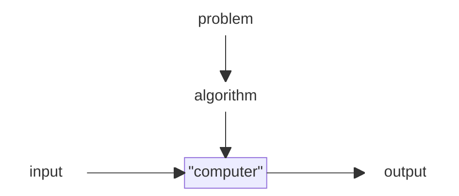
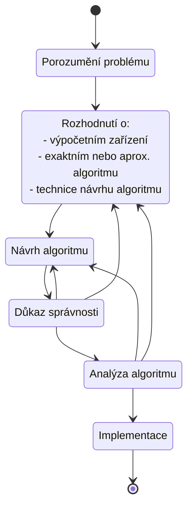

# Algoritmy (ALG I, ALG II, ZSU, UTI)

> - Strategie algoritmického řešení problémů (strategie řešení hrubou silou, úplným prohledáváním, sniž a vyřeš, rozděl a panuj, transformuj a vyřeš, záměna paměťové a časové složitosti, dynamické programování, hladové algoritmy).
> - Složitost algoritmů (asymptotická notace, korektnost algoritmů a její analýza).
> - Základní datové struktury (pole, seznam, zásobník, fronta, graf, vyhledávací strom, hašovací tabulka, halda).
> - Explorativní analýza dat (data a jejich vlastnosti – numerické, kategoriální a jiné atributy, statistické vlastnosti dat, vztahy mezi atributy).
> - Metody strojového učení (shlukování, klasifikace, vyhodnocení algoritmů).
> **Příklad otázky**: Základní myšlenka strategie rozděl a panuj. Praktická ukázka použití, QuickSort a jeho časová složitost. Srovnání se strategií řešení hrubou silou, BubbleSort.

## Zdroje
- [Prezentace Algoritmů](https://www.cs.vsb.cz/dvorsky/)
- [Materiály k UTI](https://www.cs.vsb.cz/sawa/uti/)

# Algoritmické otázky

**Algoritmus** je sekvence jednoznačných instrukcí určených k řešení problému. Na nějaký platný vstup vrátí v určitém množstvím času vyžadovaný výstup. Diagram níže znázorňuje průběh algoritmu:

Algoritmus lze zapsat jako:
- přirozený jazyk
- pseudokód
- programovací jazyk (spíše implementace)
- flowchart (dle Dvorského dnes již prý nepoužívané xd)

Každý algoritmus má následující vlastosti:
- **Správnost** (*correctness*) &mdash; zda algoritmus vrátí v konečném čase správný výsledek
- **Časová složitost** (*time complexity*) &mdash; jak dlouho algoritmus "pracuje"
- **Prostorová složitost** (*space complexity*) &mdash; kolik paměti algoritmus spotřebuje
- **Jednoduchost** (*simplicity*) &mdash; nelze přesně definovat, jde o preferenci, jednodušší algoritmus je snažší pochopit
- **Obecnost** &mdash; návrh (resp. algoritmus) by měl zpracovat všechny očekávatelné a přirozené instance problému, nemá moc edge cases

## Strategie algoritmického řešení problémů

> [!IMPORTANT]
> Neviděl jsem, že by se někdo u státnic na tyhle informace ptal. Ptají se více na přímé strategie než obecný popis toho, co ta strategie je. To nicméně neznamená, že ty informace jsou úplně k ničemu.

Proces návrhu algoritmu vypadá takhle:

Ve některých krocích se můžeme vracet k předchozím krokům, tedy pokud se něco nepovede v důkazu správnosti, můžeme se vracet k rozhodnutí nebo návrhu. **Výpočetním zařízením** se v dnešní době myslí zpravidla teoretický Von Neumannův RAM stroj. Můžeme navrhnout následující dva typy algoritmů:
1. **Exaktní** &mdash; poskytuje přesné řešení
2. **Aproximační** &mdash; posktyuje přibližné řešení, pro problémy, které neumíme řešit jako exaktní anebo jejich exaktní řešení je moc náročné (pomalé)

O analýze složitosti a korektnosti se dále budu bavit ve [Složitosti algoritmů](#složitost-algoritmů). Existují určité strategie, kterými se lze dostat k nějakému algoritmickému řešení a ty se zdají jako to nejvíc hot téma na státnicích. Pojďme se na ně tedy podívat.

### Řešení hrubou silou
Je založena na **přímočarém přístupu k řešení problému**, kdy algoritmus vychází ze zadání problémů a pojmů v něm. Příkladem je výpočet mocniny. Pro $a^n$, kde $a$ je nenulové a $n$ přirozené, je definice mocnění následující:

$$a^n = \underbrace{a * a * \cdots * a}_{n \text{ krát}}$$

Řešením hrubou silou je zde vynásobit $a$ se samo sebou $n-1$ krát. Je to prostě takové to nejvíc lazy a straightforward řešení.

<!-- kostra grafu, quicksort, bubblesort,  -->

## Složitost algoritmů

<!-- TODO korektnost přes matematickou indukci, to bude asi víc alg-ii? -->

